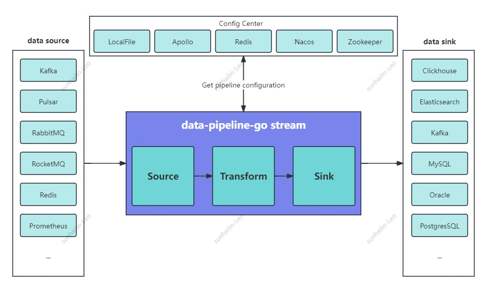
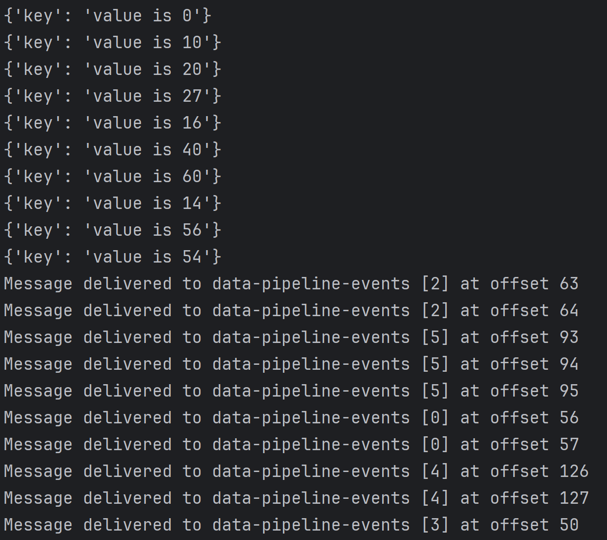
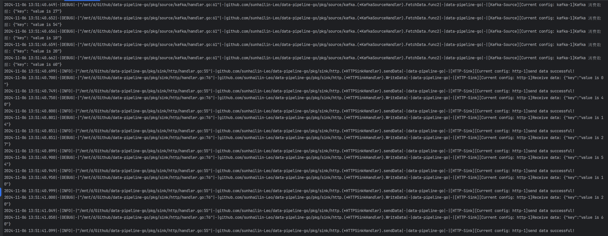
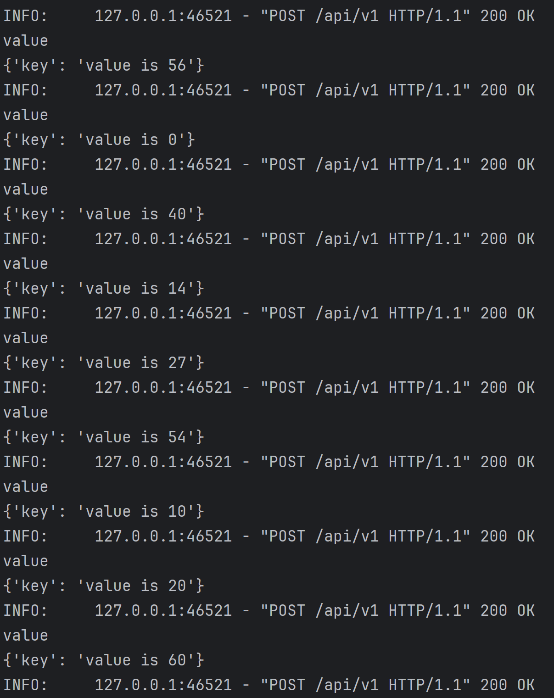

<h1 style="text-align: center;">data-pipeline-go</h1>

---

## 项目介绍
基于 Golang 实现一个类似 SeaTunnel 的数据同步工具, 主要是为了**简便易用**
  * 数据源多样：兼容基本常用的数据源。
  * 管理和维护简单：基于容器化部署或二进制部署，部署维护简便
  * 资源利用率高/高性能：Golang 天然资源利用率高 + Channel 实现的高性能同步数据流

### 项目架构


## 静态检查

* Windows 下需要安装 make 命令
  * https://gnuwin32.sourceforge.net/packages/make.htm
  * 安装完后加环境变量即可

* golangci-lint
  * 安装: `curl -sSfL https://raw.githubusercontent.com/golangci/golangci-lint/master/install.sh | sh -s -- -b $(go env GOPATH)/bin v1.59.1` 或 `brew install golangci-lint`
  * 检查: `golangci-lint --version`

* nilaway
  * 安装: `go install go.uber.org/nilaway/cmd/nilaway@latest`
  * 检查: `nilaway ./...`


## 快速启动

### 添加作业配置文件来定义作业

* 配置文件示例: [example/kafka_to_http.json](example/kafka_to_http.json)
```json
{
    "streams": [
        {
            "name": "stream-1",
            "enable": true,
            "channel_size": 1000,
            "source": [
                {
                    "type": "Kafka",
                    "source_name": "kafka-1",
                    "kafka": {
                        "address": "kfk-01.com:9092,kfk-01.com:9092,kfk-01.com:9092",
                        "group": "test-default",
                        "topic": "data-pipeline-events"
                    }
                }
            ],
            "transform": {
                "mode": "json",
                "schemas": [
                    {
                        "source_key": "key",
                        "sink_key":  "key",
                        "converter": "toString",
                        "is_ignore": false,
                        "is_strict_mode": true,
                        "is_keep_keys": true,
                        "source_name": "kafka-1",
                        "sink_name": "http-1"
                    }
                ]
            },
            "sink": [
                {
                    "type": "HTTP",
                    "sink_name": "http-1",
                    "http": {
                        "url": "http://0.0.0.0:8000/api/v1",
                        "content_type": "application/json",
                        "headers": {
                            "key": "value"
                        }
                    }
                }
            ]
        }
    ]
}
```
* 配置文件说明: 
  * 配置文件的格式为 json 格式
  * 配置文件的 `streams` 内容为一个数组, 数组中的每个元素为一个作业
  * `source` 为输入源
  * `transform` 为数据转换
  * `sink` 为输出源
  * 该示例中的作业为从 kafka 读取数据, 然后将数据转换为 json 格式, 然后将数据发送到 http 服务


### 直接运行
```shell
# go version >= 1.22.0
# 以本地配置文件为例
export CONFIG_SRC=local 
export LOCAL_PATH=../example/kafka_to_http.json 
cd data-pipeline-go/cmd && go run main.go
```
### 从二进制文件启动
```shell
# go version >= 1.22.0
cd data-pipeline-go/cmd
# 设置环境变量
export CONFIG_SRC=local
export LOCAL_PATH=example/kafka_to_http.json

# 编译项目
go build -o data-pipeline-go ./main.go
# 启动项目
./data-pipeline-go
```

### 运行效果
#### 随机写入 10 条数据到 kafka 中


#### data-pipeline-go 运行结果


#### HTTP 接口 打印请求数据



## 实现模块

[ROADMAP](ROADMAP.md)

## 版本日志

[CHANGELOG](CHANGELOG.md)
