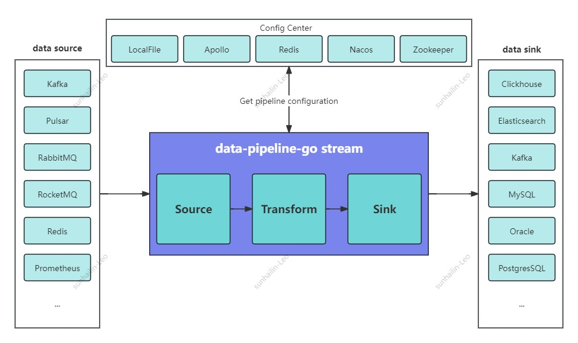
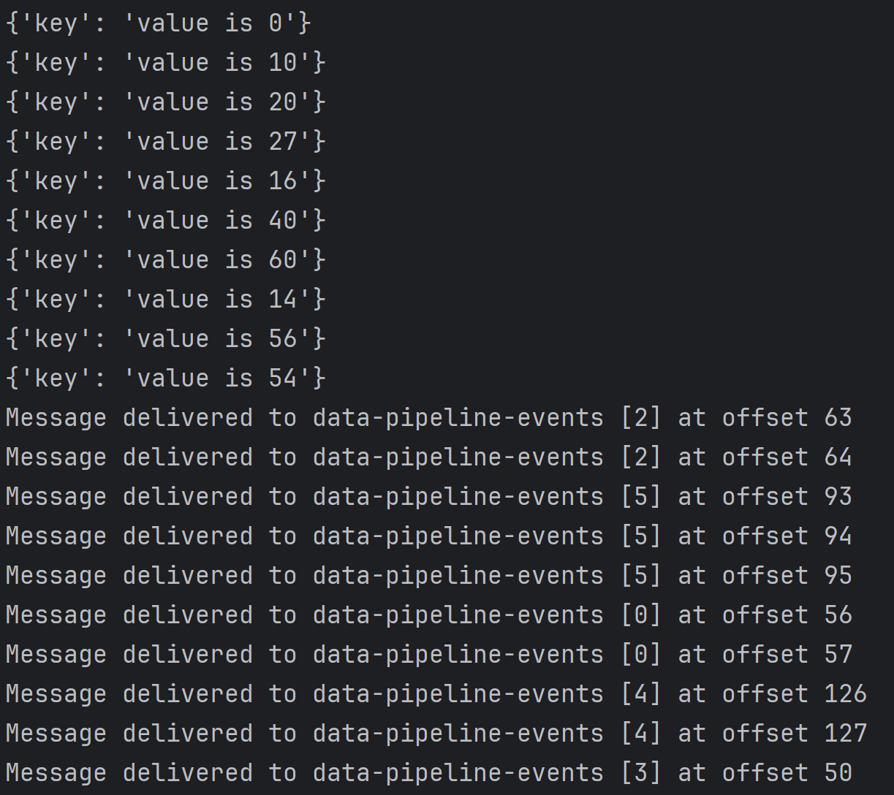
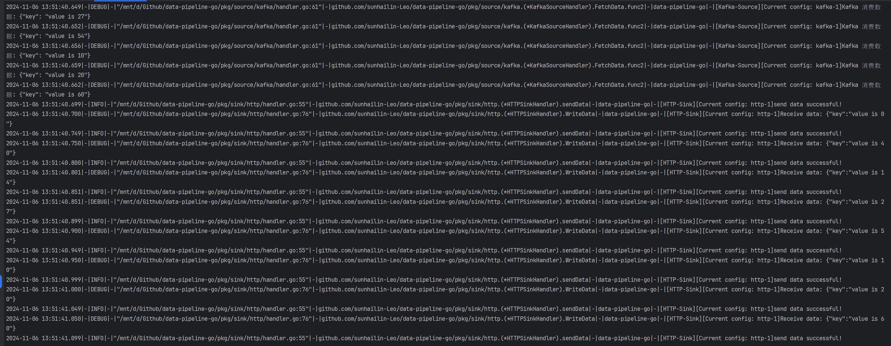
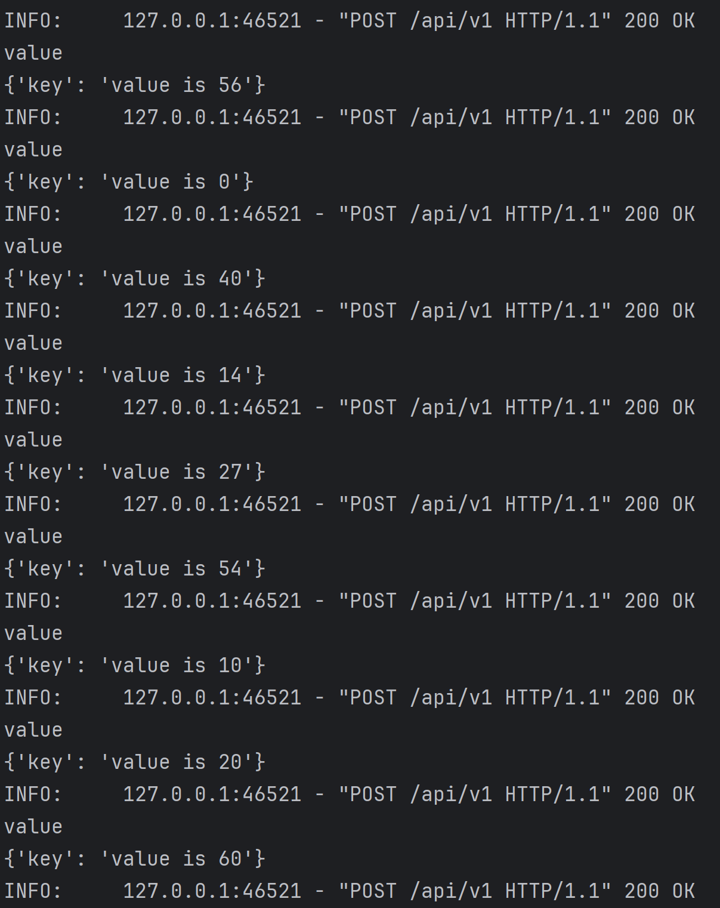

<h1 align="center">data-pipeline-go</h1>

<p align="center">
  <em>A high-performance data synchronization tool built with Go, inspired by SeaTunnel</em>
</p>

<p align="center">
  <a href="https://github.com/sunhailin-Leo/data-pipeline-go/actions/workflows/test.yml"></a>
  <a href="https://github.com/sunhailin-Leo/data-pipeline-go/actions/workflows/lint.yml"></a>
  <a href="https://github.com/sunhailin-Leo/data-pipeline-go/actions/workflows/build.yml"></a>
  <a href="https://github.com/sunhailin-Leo/data-pipeline-go/actions/workflows/codeql.yml"></a>
  <a href="https://codecov.io/gh/sunhailin-Leo/data-pipeline-go"></a>
  <a href="https://goreportcard.com/report/github.com/sunhailin-Leo/data-pipeline-go"></a>
  <a href="https://pkg.go.dev/github.com/sunhailin-Leo/data-pipeline-go"></a>
  <a href="../../LICENSE"></a>
  <a href="https://github.com/sunhailin-Leo/data-pipeline-go/releases"></a>
</p>

<p align="center">
  <a href="../../README.md">中文</a> | <a href="README.md">English</a>
</p>

---

## Introduction

A SeaTunnel-like data synchronization tool built with Go, designed for **simplicity and ease of use**:

- **Diverse Data Sources**: Compatible with commonly used data sources
- **Easy to Manage**: Deploy via containers or binaries with minimal maintenance
- **High Performance**: Leveraging Go's native efficiency + Channel-based high-performance data streaming
- **Multi-Source Input**: Fan-in mode — merge multiple Sources into a single Stream
- **Row-Level Filtering**: Conditional filtering with 11 operators

### Architecture



## Core Architecture

- **Source**: Kafka, RocketMQ, RabbitMQ, Pulsar, Redis, Prometheus Metrics
- **Transform**: Three modes (Row, JSON, JsonPath) with type casting, field filtering, field expansion, and row-level data filtering
- **Sink**: ClickHouse, Console, HTTP, Kafka, Redis, PostgreSQL, MySQL, Oracle, Elasticsearch 7/8, LocalFile, Pulsar, RocketMQ, RabbitMQ
- **Stream**: Channels connect modules, ants goroutine pool manages concurrency, multi-source Fan-in merging
- **Committer**: Three ACK modes — after consume (0), after transform (1), after sink write (2)

## Configuration Sources

| Source | CONFIG_SRC | Required Env Vars | Optional Env Vars |
|--------|-----------|-------------------|-------------------|
| Local | local | LOCAL_PATH | - |
| Apollo | apollo | APOLLO_HOST, APOLLO_CONFIG_KEY | APOLLO_APP_ID, APOLLO_NAMESPACE, APOLLO_CLUSTER_KEY |
| Redis | redis | REDIS_HOST, REDIS_CONFIG_KEY | REDIS_USERNAME, REDIS_PASSWORD, REDIS_DB |
| Nacos | nacos | NACOS_IP, NACOS_PORT, NACOS_DATA_ID, NACOS_GROUP | NACOS_NAMESPACE_ID |
| Zookeeper | zookeeper | ZOOKEEPER_HOSTS, ZOOKEEPER_CONFIG_PATH | - |
| HTTP-Get | http | HTTP_HOSTS, HTTP_CONFIG_URI | HTTP_HEARTBEAT_URI, HTTP_HEARTBEAT_INTERVAL_SECS |

## Transform Modes

- **Row Mode**: Split raw text by delimiter
- **JSON Mode**: Field mapping, type casting, is_ignore, is_strict_mode, is_keep_keys, is_expand
- **JsonPath Mode**: Extract nested data using JsonPath expressions

### Data Filtering

Row-level data filtering is supported in JSON / JsonPath modes with the following operators:

| Operator | Description | Example |
|----------|-------------|---------|
| `eq` | Equal | `{"field": "status", "operator": "eq", "value": "active"}` |
| `neq` | Not equal | `{"field": "status", "operator": "neq", "value": "deleted"}` |
| `gt` / `gte` | Greater than / Greater or equal | `{"field": "age", "operator": "gt", "value": 18}` |
| `lt` / `lte` | Less than / Less or equal | `{"field": "score", "operator": "lt", "value": 60}` |
| `contains` | Contains substring | `{"field": "name", "operator": "contains", "value": "test"}` |
| `not_contains` | Does not contain | `{"field": "name", "operator": "not_contains", "value": "temp"}` |
| `regex` | Regex match | `{"field": "email", "operator": "regex", "value": "^.*@gmail\\.com$"}` |
| `in` / `not_in` | In / Not in list | `{"field": "type", "operator": "in", "value": ["A","B"]}` |

## Monitoring & Alerting

- **Prometheus Metrics**: Port 8080, path `/metrics`
- **pprof**: Auto-registered via `net/http/pprof`
- **Grafana Dashboard**: 13 pre-built panels (`deploy/grafana/dashboard.json`)
- **Alert Rules**: 7 pre-built Prometheus alert rules (`deploy/prometheus/alert_rules.yml`)
- **Monitoring Stack**: `docker compose -f deploy/docker-compose.monitoring.yml up -d`

## Quick Start

### Prerequisites

- Go >= 1.24.0
- Configuration file (JSON format)

### Define a Job Configuration

Example: [example/kafka_to_http.json](../../example/kafka_to_http.json)

```json
{
    "streams": [
        {
            "name": "stream-1",
            "enable": true,
            "channel_size": 1000,
            "source": [
                {
                    "type": "Kafka",
                    "source_name": "kafka-1",
                    "kafka": {
                        "address": "kfk-01.com:9092,kfk-01.com:9092,kfk-01.com:9092",
                        "group": "test-default",
                        "topic": "data-pipeline-events"
                    }
                }
            ],
            "transform": {
                "mode": "json",
                "schemas": [
                    {
                        "source_key": "key",
                        "sink_key":  "key",
                        "converter": "toString",
                        "is_ignore": false,
                        "is_strict_mode": true,
                        "is_keep_keys": true,
                        "source_name": "kafka-1",
                        "sink_name": "http-1"
                    }
                ]
            },
            "sink": [
                {
                    "type": "HTTP",
                    "sink_name": "http-1",
                    "http": {
                        "url": "http://0.0.0.0:8000/api/v1",
                        "content_type": "application/json",
                        "headers": {
                            "key": "value"
                        }
                    }
                }
            ]
        }
    ]
}
```

Configuration notes:
- Format: JSON
- `streams`: Array of jobs, each element is an independent data stream
- `source`: Input sources (supports multiple sources with automatic Fan-in merging)
- `transform`: Data transformation rules
- `sink`: Output targets

### Run Directly

```shell
export CONFIG_SRC=local
export LOCAL_PATH=../example/kafka_to_http.json
cd data-pipeline-go/cmd && go run main.go
```

### Build and Run

```shell
cd data-pipeline-go
make build
export CONFIG_SRC=local
export LOCAL_PATH=example/kafka_to_http.json
./cmd/data-pipeline-go
```

### Docker Deployment

```shell
make docker-build
docker run --rm \
  -e CONFIG_SRC=local \
  -e LOCAL_PATH=/app/config.json \
  -v $(pwd)/example/kafka_to_http.json:/app/config.json \
  data-pipeline-go
```

### Demo

#### Write 10 random records to Kafka


#### data-pipeline-go output


#### HTTP endpoint prints request data


## Development Guide

### Makefile Commands

| Command | Description |
|---------|-------------|
| `make help` | Show help information |
| `make lint` | Run golangci-lint static analysis |
| `make nilaway` | Run nilaway nil checks |
| `make test` | Run unit tests |
| `make coverage` | Generate coverage report (HTML) |
| `make benchmark` | Run benchmark tests |
| `make build` | Build binary |
| `make fmt` | Format code |
| `make docker-build` | Build Docker image |
| `make clean` | Clean build artifacts |

### Static Analysis Tools

- **golangci-lint**: `curl -sSfL https://raw.githubusercontent.com/golangci/golangci-lint/master/install.sh | sh -s -- -b $(go env GOPATH)/bin v2.1.6` or `brew install golangci-lint`
- **nilaway**: `go install go.uber.org/nilaway/cmd/nilaway@latest`

## Roadmap

[ROADMAP](../../ROADMAP.md)

## Changelog

[CHANGELOG](../../CHANGELOG.md)

## Contributing

Issues and Pull Requests are welcome! Please ensure:

1. Code passes `make lint`
2. New features include unit tests
3. Related documentation is updated

## License

[MIT License](../../LICENSE)
